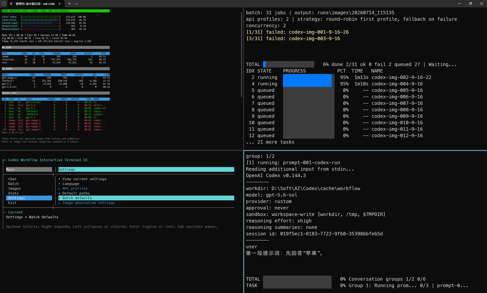

# Codex CLI Auto

[简体中文](./README.zh-CN.md)

## Requirements

- Windows PowerShell
- Node.js 18 or newer
- `codex` available on `PATH`
- `OPENAI_API_KEY` for image generation, unless available from Codex auth
- A running local OpenAI-compatible proxy if you use one

## Start

Install the terminal progress dependencies once:

```powershell
npm ci
```

PowerShell:

```powershell
powershell -ExecutionPolicy Bypass -File .\Start-CodexWorkflow.ps1
```

CMD:

```cmd
ask-codex.cmd
```

## Interactive Menu


